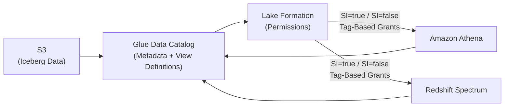
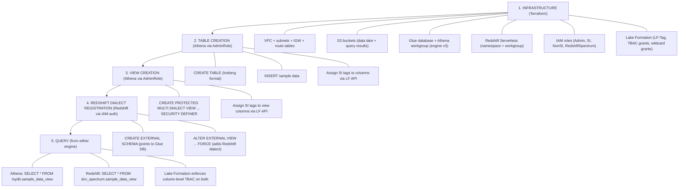

# AWS Glue Data Catalog Multi-Dialect Views: A Deep Dive into Cross-Engine Lakehouse Access Control

## Introduction

If you're building an AWS lakehouse and need both Athena and Redshift Spectrum to query the same logical views — with centralized, column-level access control — you'll eventually land on **AWS Glue Data Catalog Multi-Dialect Views** (MDVs). The concept is elegant: one view object in the Glue catalog holds SQL definitions for multiple engines, and Lake Formation governs who can see what.

In practice, getting this to work end-to-end involves a surprising number of moving parts. This post documents everything we learned building a working prototype: the infrastructure, the permissions model, the gotchas, and the exact sequence of operations required.

---

## What is a Multi-Dialect View?

A Multi-Dialect View (MDV) is a view object in the [AWS Glue Data Catalog](https://docs.aws.amazon.com/glue/latest/dg/catalog-and-crawler.html) that stores SQL definitions in multiple engine-specific dialects. Each query engine (Athena/Trino, Redshift, Spark) uses its own dialect when resolving the view.

Key characteristics:

- **Single catalog object, multiple SQL definitions** — one view can hold a Trino dialect (for Athena) and a Redshift dialect simultaneously
- **Centralized permissions via Lake Formation** — access is managed once, regardless of which engine queries the view
- **SECURITY DEFINER semantics** — the view creator's permissions are used at query time, so consumers only need access to the view itself, not the underlying tables
- **Column-level tag-based access control (TBAC)** — Lake Formation tags on view columns determine which columns each role can see

This is fundamentally different from Athena's legacy views (which are Athena-only and stored as Presto/Trino view metadata) or Redshift's internal views. An MDV is a first-class Glue catalog resource that multiple engines can resolve.

**References:**
- [Working with Data Catalog views](https://docs.aws.amazon.com/lake-formation/latest/dg/working-with-views.html)
- [Creating Data Catalog views using DDL statements](https://docs.aws.amazon.com/lake-formation/latest/dg/create-views.html)
- [Use Data Catalog views in Athena](https://docs.aws.amazon.com/athena/latest/ug/views-glue.html)

---

## Architecture Overview

The architecture consists of:

1. **S3** — stores the actual data (Iceberg tables with Parquet files)
2. **AWS Glue Data Catalog** — metadata store for databases, tables, and views
3. **AWS Lake Formation** — permission layer with tag-based access control
4. **Amazon Athena** — serverless SQL engine (Trino-based) for creating tables, views, and querying
5. **Amazon Redshift Serverless** — data warehouse engine accessing the same catalog via Spectrum
6. **IAM Roles** — three consumer roles (Admin, SI, NonSI) plus a Redshift service role

The data flow:



---

## Infrastructure Setup

### S3 Buckets

Two buckets are needed:

1. **Data Lake bucket** — stores the Iceberg table data (Parquet files). Versioning enabled, SSE-AES256, all public access blocked.
2. **Query Results bucket** — Athena writes query results here. Required by the Athena workgroup configuration.

### Glue Catalog Database

A single Glue database serves as the container for all tables and views. Its `location_uri` points to the data lake bucket root.

### Athena Workgroup

The workgroup must use **Athena engine version 3** — this is required for `CREATE PROTECTED MULTI DIALECT VIEW` syntax. Earlier engine versions do not support MDVs.

```sql
-- This syntax requires Athena engine version 3
CREATE OR REPLACE PROTECTED MULTI DIALECT VIEW mydb.my_view SECURITY DEFINER AS
SELECT * FROM mydb.my_table
```

**Reference:** [Athena engine versioning](https://docs.aws.amazon.com/athena/latest/ug/engine-versions.html)

### Redshift Serverless

A Redshift Serverless namespace and workgroup provide the second query engine. Key configuration:

- **Namespace**: uses `manage_admin_password = true` (password stored in Secrets Manager, no static credentials)
- **Workgroup**: configured with base/max capacity of 8 RPU (minimum) to control costs
- **IAM Roles**: the RedshiftSpectrumRole is attached to the namespace via `iam_roles`
- **Networking**: requires subnets in at least 2 AZs

**Reference:** [Amazon Redshift Serverless](https://docs.aws.amazon.com/redshift/latest/mgmt/serverless-workgroup-namespace.html)

### VPC Requirements for Public Access

If you set `publicly_accessible = true` on the Redshift workgroup (for development/testing), the VPC **must** have:

1. An Internet Gateway attached to the VPC
2. A route table with a `0.0.0.0/0` route through the IGW
3. Route table associations on all subnets used by the workgroup

**Without these, the workgroup gets stuck in `CREATING` state indefinitely** (45+ minutes) because AWS cannot provision the public endpoint. There is no error message — it just hangs. This is one of the most frustrating debugging experiences in this setup.

The security group should allow inbound on port 5439 (Redshift's default port).

---

## IAM Roles and Permissions

### Role Design

We use four IAM roles:

| Role | Purpose |
|------|---------|
| **AdminRole** | Creates tables/views, assigns LF tags, full database access |
| **SIRole** | Read access to columns tagged SI=true AND SI=false (sees everything) |
| **NonSIRole** | Read access only to columns tagged SI=false (sensitive columns hidden) |
| **RedshiftSpectrumRole** | Service role attached to Redshift namespace for catalog/data access |

### AdminRole

The AdminRole needs:

- **Athena**: `StartQueryExecution`, `GetQueryExecution`, `GetQueryResults`, `GetWorkGroup` on the workgroup
- **S3**: Read/write on both the data lake and query results buckets
- **Glue**: Full table management (`CreateTable`, `UpdateTable`, `DeleteTable`, `GetTable`, etc.) scoped to the database
- **Lake Formation**: `GetDataAccess`, `AddLFTagsToResource`, `RemoveLFTagsFromResource`, `GetResourceLFTags`, `ListLFTags`
- **iam:PassRole**: Must be able to pass itself to `glue.amazonaws.com` — required for SECURITY DEFINER views

**Critical for SECURITY DEFINER views**: The AdminRole's trust policy must allow `glue.amazonaws.com` to assume it. At query time, Glue assumes the view definer's role to resolve the underlying data. Without this trust relationship, queries against the view will fail with an access denied error.

```json
{
  "Effect": "Allow",
  "Principal": { "Service": "glue.amazonaws.com" },
  "Action": "sts:AssumeRole"
}
```

**Reference:** [Security and access control for Data Catalog views](https://docs.aws.amazon.com/lake-formation/latest/dg/views-security.html)

### SIRole and NonSIRole

These are read-only consumer roles. They need:

- **Athena**: Query execution permissions on the workgroup
- **S3**: Read on the data lake bucket, read/write on query results
- **Glue**: Read-only catalog access (`GetDatabase`, `GetTable`, etc.)
- **Lake Formation**: `GetDataAccess` (required for LF-governed data access)

The actual data access is controlled entirely by Lake Formation TBAC grants (covered below).

### RedshiftSpectrumRole

This is a service role assumed by Redshift itself (not by users). It needs:

- **Glue**: `GetDatabase`, `GetDatabases`, `GetTable`, `GetTables`, `GetPartition`, `GetPartitions`, **`UpdateTable`**
- **S3**: `GetObject`, `ListBucket`, `GetBucketLocation` on the data lake bucket
- **Lake Formation**: `GetDataAccess`

The `glue:UpdateTable` permission is the non-obvious one — it's required because `ALTER EXTERNAL VIEW` (which registers the Redshift dialect) updates the view's metadata in the Glue catalog.

**Reference:** [IAM policies for Amazon Redshift Spectrum](https://docs.aws.amazon.com/redshift/latest/dg/c-spectrum-iam-policies.html)

---

## Lake Formation Permissions (Tag-Based Access Control)

### LF-Tag Setup

We create a single LF-Tag:

- **Key**: `SI`
- **Values**: `true`, `false`

This tag is assigned at the column level on both tables and views. Columns containing sensitive information (e.g., SSN) get `SI=true`. Non-sensitive columns get `SI=false`.

### Permission Grants

| Principal | Permission | Resource | Effect |
|-----------|-----------|----------|--------|
| AdminRole | `ASSOCIATE`, `DESCRIBE` | LF-Tag `SI` | Can assign the tag to resources |
| AdminRole | `CREATE_TABLE`, `DESCRIBE` | Database | Can create tables and views |
| AdminRole | `ALL` (with grant option) | All tables in database (wildcard) | Full control over all tables/views |
| SIRole | `DESCRIBE` | Database | Can see the database |
| SIRole | `SELECT` | Tables tagged `SI=true` OR `SI=false` | Can query all columns |
| NonSIRole | `DESCRIBE` | Database | Can see the database |
| NonSIRole | `SELECT` | Tables tagged `SI=false` only | Cannot see SI-tagged columns |
| RedshiftSpectrumRole | `DESCRIBE` | Database | Can resolve external schema |
| RedshiftSpectrumRole | `SELECT` | Tables tagged `SI=true` OR `SI=false` | Can read data for Spectrum queries |
| RedshiftSpectrumRole | `ALTER` | All tables in database (wildcard) | Can register Redshift dialect |

**Reference:** [Lake Formation tag-based access control](https://docs.aws.amazon.com/lake-formation/latest/dg/tag-based-access-control.html)

### The AdminRole Permission Problem

Assigning LF tags to a Data Catalog View is trickier than assigning them to a table. We found three approaches:

1. **Make the role a Lake Formation admin** — works but is overly permissive (not recommended for production)
2. **Grant `ALL` on resources with a specific LF tag** — requires the tag to already be on the resource, creating a chicken-and-egg problem for newly created views
3. **Grant `ALL` on all tables within a specific database (wildcard)** — the pragmatic solution

We went with option 3. The AdminRole gets `ALL` with grant option on all tables (wildcard) in the database. This means it can create views and immediately assign tags to them without any circular dependency. The security trade-off is acceptable if the database is scoped to a single purpose.

---

## Creating the Multi-Dialect View

### Step 1: Create the Base Table

First, create an Iceberg table in the Glue catalog via Athena:

```sql
CREATE TABLE mydb.sample_data (
  id int,
  name string,
  ssn string
)
LOCATION 's3://my-data-lake-bucket/mydb/sample_data'
TBLPROPERTIES (
  'table_type'='iceberg',
  'compression_level'='3',
  'format'='PARQUET',
  'write_compression'='ZSTD'
)
```

Then insert sample data:

```sql
INSERT INTO mydb.sample_data
SELECT * FROM (VALUES
  (1, 'Alice Johnson', '123-45-6789'),
  (2, 'Bob Smith', '987-65-4321'),
  (3, 'Charlie Brown', '555-12-3456')
) AS t(id, name, ssn)
```

### Step 2: Assign SI Tags to Table Columns

Using the Lake Formation API (`AddLFTagsToResource`), assign tags to each column:

- `id` → `SI=false`
- `name` → `SI=false`
- `ssn` → `SI=true`

### Step 3: Create the Protected Multi-Dialect View (Athena)

```sql
CREATE OR REPLACE PROTECTED MULTI DIALECT VIEW mydb.sample_data_view SECURITY DEFINER AS
SELECT * FROM mydb.sample_data
```

Key points about this syntax:

- **`PROTECTED`** — enables Lake Formation governance on the view
- **`MULTI DIALECT`** — marks this as an MDV that can hold multiple SQL dialects
- **`SECURITY DEFINER`** — queries run with the creator's permissions (AdminRole), so consumers only need access to the view
- This registers **only the Athena (Trino) dialect**

**Reference:** [CREATE VIEW (Athena DDL)](https://docs.aws.amazon.com/athena/latest/ug/create-view.html)

### Step 4: Assign SI Tags to View Columns

After creating the view, assign the same SI tags to the view's columns:

- `id` → `SI=false`
- `name` → `SI=false`
- `ssn` → `SI=true`

This is what enables column-level TBAC on the view. When NonSIRole queries the view, Lake Formation filters out columns tagged `SI=true` (the `ssn` column).

### Step 5: Add the Redshift Dialect (from Redshift)

This is where things get interesting. The Redshift dialect **cannot** be added from Athena. You must run `ALTER EXTERNAL VIEW` from within Redshift itself:

```sql
ALTER EXTERNAL VIEW "dcv_spectrum"."sample_data_view" FORCE AS
SELECT * FROM "dcv_spectrum"."sample_data"
```

The `FORCE` keyword makes this idempotent — it updates the dialect if it already exists, or adds it if it doesn't.

**Reference:** [ALTER EXTERNAL VIEW (Redshift)](https://docs.aws.amazon.com/redshift/latest/dg/r_ALTER_EXTERNAL_VIEW.html)

---

## Making Redshift Spectrum Work with MDVs

### Creating the External Schema

Before Redshift can see Glue catalog objects, you need an external schema:

```sql
CREATE EXTERNAL SCHEMA dcv_spectrum
FROM DATA CATALOG
DATABASE 'mydb'
IAM_ROLE 'arn:aws:iam::123456789012:role/RedshiftSpectrumRole'
CATALOG_ID '123456789012'
REGION 'us-east-1'
```

This maps the Glue database to a Redshift schema. All tables and views in the Glue database become visible under this schema.

**Reference:** [CREATE EXTERNAL SCHEMA](https://docs.aws.amazon.com/redshift/latest/dg/r_CREATE_EXTERNAL_SCHEMA.html)

### The ALTER EXTERNAL VIEW Transaction Problem

`ALTER EXTERNAL VIEW` **cannot run inside a transaction block**. If you're using a Python connector (like `redshift_connector`), connections default to transactional mode. You must explicitly exit the transaction before running the ALTER:

```python
import redshift_connector

conn = redshift_connector.connect(...)

# Exit any open transaction
conn.rollback()
conn.autocommit = True

cursor = conn.cursor()
cursor.execute('ALTER EXTERNAL VIEW "dcv_spectrum"."my_view" FORCE AS SELECT * FROM "dcv_spectrum"."my_table"')

conn.autocommit = False  # restore normal mode
```

Without this, you'll get a cryptic error about the statement not being allowed in a transaction block.

### Lake Formation and IAM Permissions for ALTER EXTERNAL VIEW

For `ALTER EXTERNAL VIEW` to succeed, the RedshiftSpectrumRole needs permissions at two layers:

### Permissions Required for ALTER EXTERNAL VIEW

For `ALTER EXTERNAL VIEW` to succeed, the RedshiftSpectrumRole (the IAM role attached to the namespace) needs two things:

1. **IAM permission**: `glue:UpdateTable` — because the ALTER modifies the view's metadata in the Glue catalog
2. **Lake Formation permission**: `ALTER` on the view — Lake Formation enforces its own permission layer on top of IAM

Since the view may not be tagged yet at the time of the ALTER (TBAC grants won't match an untagged resource), use a direct wildcard grant:

```hcl
resource "aws_lakeformation_permissions" "redshift_spectrum_alter_tables" {
  principal   = aws_iam_role.redshift_spectrum.arn
  permissions = ["ALTER"]

  table {
    wildcard      = true
    database_name = aws_glue_catalog_database.lakehouse_db.name
    catalog_id    = local.account_id
  }
}
```

### Securing ALTER EXTERNAL VIEW with Redshift Schema Ownership

Granting `ALTER` to the RedshiftSpectrumRole at the Lake Formation level is necessary, but it doesn't mean every Redshift user can modify views. Redshift has its own access control layer based on **schema ownership**.

The recommended approach:

1. **A designated admin user creates the external schema** — this user becomes the schema owner
2. **Only the schema owner can run DDL** (`ALTER EXTERNAL VIEW`, `CREATE EXTERNAL TABLE`) within that schema
3. **Other users get only `USAGE` + `SELECT`** — they can query but cannot modify anything

```sql
-- Admin creates the external schema (becomes owner)
CREATE EXTERNAL SCHEMA dcv_spectrum
FROM DATA CATALOG
DATABASE 'mydb'
IAM_ROLE 'arn:aws:iam::123456789012:role/RedshiftSpectrumRole'
CATALOG_ID '123456789012'
REGION 'us-east-1';

-- Admin registers the Redshift dialect (only owner can do this)
ALTER EXTERNAL VIEW "dcv_spectrum"."sample_data_view" FORCE AS
SELECT * FROM "dcv_spectrum"."sample_data";

-- Grant read-only access to analysts
GRANT USAGE ON SCHEMA dcv_spectrum TO ROLE analyst_role;
GRANT SELECT ON ALL TABLES IN SCHEMA dcv_spectrum TO ROLE analyst_role;
```

You can also explicitly transfer ownership if needed:

```sql
ALTER SCHEMA dcv_spectrum OWNER TO deploy_admin;
```

This gives you a layered security model:

| Layer | Control | Effect |
|-------|---------|--------|
| **Redshift schema ownership** | Only the schema owner can run DDL | Prevents unauthorized users from altering views |
| **IAM role association** | Only users granted `ASSOCITATE` on the IAM role can reference it | Prevents unauthorized role usage |
| **Lake Formation ALTER grant** | RedshiftSpectrumRole has ALTER on the database | Allows the Glue catalog update to succeed |
| **Lake Formation TBAC** | SELECT grants based on SI tags | Controls what data each role can read |

The net effect: even though the RedshiftSpectrumRole has broad ALTER permission at the Lake Formation level, only the Redshift schema owner can actually trigger it. Regular users are limited to querying.

**Reference:** [GRANT (Redshift)](https://docs.aws.amazon.com/redshift/latest/dg/r_GRANT.html)

---

## Connecting to Redshift Serverless with IAM Authentication

When the namespace uses `manage_admin_password = true`, there's no static password. You must use IAM authentication:

```python
import boto3
import redshift_connector

session = boto3.Session(region_name="us-east-1")
creds = session.get_credentials().get_frozen_credentials()

# Extract workgroup name from endpoint hostname
# Format: <workgroup-name>.<account-id>.<region>.redshift-serverless.amazonaws.com
host = "my-workgroup.123456789012.us-east-1.redshift-serverless.amazonaws.com"
workgroup_name = host.split(".")[0]

conn = redshift_connector.connect(
    iam=True,
    host=host,
    port=5439,
    database="dev",
    user="admin",
    access_key_id=creds.access_key,
    secret_access_key=creds.secret_key,
    session_token=creds.token,
    region="us-east-1",
    is_serverless=True,
    serverless_work_group=workgroup_name,
)
```

Critical parameters:

- **`iam=True`** — without this, the driver attempts password auth which fails
- **`is_serverless=True`** — tells the driver to use the serverless authentication flow
- **`serverless_work_group`** — the workgroup name (not the full endpoint)
- Your IAM identity needs `redshift-serverless:GetCredentials` on the workgroup

**Reference:** [Using the Amazon Redshift Python connector](https://docs.aws.amazon.com/redshift/latest/mgmt/python-connect-examples.html)

---

## The Error You'll Hit Without the Redshift Dialect

If you create the view via Athena and then try to query it from Redshift Spectrum without adding the Redshift dialect, you'll get:

```
AwsClientException: InvalidInputException from glue - Dialect [REDSHIFT 1.0] not present
```

This is the Glue catalog telling Redshift that the view doesn't have a SQL definition it can understand. The fix is running `ALTER EXTERNAL VIEW` as described above.

---

## End-to-End Flow Summary



---

## Gotchas and Lessons Learned

### 1. Athena Engine Version Matters

`CREATE PROTECTED MULTI DIALECT VIEW` requires Athena engine version 3. If your workgroup is on an older version, the syntax will fail with a parse error.

### 2. The Redshift Dialect Must Come from Redshift

You cannot add the Redshift dialect from Athena. The `ALTER VIEW ... SET DIALECT` syntax in Athena only works for the Athena/Trino dialect. The Redshift dialect must be registered by running `ALTER EXTERNAL VIEW` from within Redshift.

**Reference:** [ALTER VIEW DIALECT (Athena)](https://docs.aws.amazon.com/athena/latest/ug/alter-view-dialect.html)

### 3. SECURITY DEFINER Requires Trust Policy

The view creator's role must trust `glue.amazonaws.com` in its assume role policy. Without this, queries against the view fail because Glue cannot assume the definer's role to resolve the underlying data.

### 4. Lake Formation Operates on Top of IAM

Having the right IAM permissions is necessary but not sufficient. Lake Formation adds its own permission layer. You need both:
- IAM policy allowing the API call (e.g., `glue:GetTable`)
- Lake Formation grant allowing the data access (e.g., `SELECT` via TBAC)

### 5. Tag Assignment on Views Requires Broad Permissions

You cannot assign LF tags to a view using TBAC-based `ALL` grants if the view hasn't been tagged yet (chicken-and-egg). Use a wildcard table grant on the database instead.

### 6. Redshift Serverless VPC Provisioning Can Hang

If `publicly_accessible = true` but the VPC lacks an Internet Gateway with proper routing, the workgroup creation will hang indefinitely with no error. Always ensure IGW + route table + associations are in place before creating a public workgroup.

### 7. Redshift Serverless Requires 2+ AZ Subnets

The workgroup requires subnets in at least two availability zones. A single subnet will cause a validation error.

### 8. ALTER EXTERNAL VIEW Cannot Run in a Transaction

When using Python's `redshift_connector`, you must set `autocommit = True` before running `ALTER EXTERNAL VIEW`. The statement is not allowed inside a transaction block.

### 9. glue:UpdateTable is Required for ALTER EXTERNAL VIEW

This IAM permission is not obvious. `ALTER EXTERNAL VIEW` modifies the view's metadata in the Glue catalog, which requires `glue:UpdateTable` on the table/view resource ARN.

---

## Cost Considerations

- **Redshift Serverless**: Minimum 8 RPU. Set `max_capacity = base_capacity` to disable auto-scaling. At 8 RPU, cost is approximately $2.88/hour when active (billed per-second with a 60-second minimum).
- **Athena**: $5 per TB scanned. Using Iceberg with Parquet and ZSTD compression minimizes scan costs.
- **S3**: Standard storage costs for the data lake bucket.
- **Lake Formation**: No additional charge for Lake Formation itself.

**Reference:** [Amazon Redshift Serverless pricing](https://aws.amazon.com/redshift/pricing/)

---

## References

| Topic | Link |
|-------|------|
| Working with Data Catalog views | https://docs.aws.amazon.com/lake-formation/latest/dg/working-with-views.html |
| Creating Data Catalog views (DDL) | https://docs.aws.amazon.com/lake-formation/latest/dg/create-views.html |
| Data Catalog views in Athena | https://docs.aws.amazon.com/athena/latest/ug/views-glue.html |
| CREATE VIEW (Athena) | https://docs.aws.amazon.com/athena/latest/ug/create-view.html |
| ALTER EXTERNAL VIEW (Redshift) | https://docs.aws.amazon.com/redshift/latest/dg/r_ALTER_EXTERNAL_VIEW.html |
| ALTER VIEW DIALECT (Athena) | https://docs.aws.amazon.com/athena/latest/ug/alter-view-dialect.html |
| Lake Formation TBAC | https://docs.aws.amazon.com/lake-formation/latest/dg/tag-based-access-control.html |
| Security for Data Catalog views | https://docs.aws.amazon.com/lake-formation/latest/dg/views-security.html |
| Redshift Spectrum IAM policies | https://docs.aws.amazon.com/redshift/latest/dg/c-spectrum-iam-policies.html |
| CREATE EXTERNAL SCHEMA (Redshift) | https://docs.aws.amazon.com/redshift/latest/dg/r_CREATE_EXTERNAL_SCHEMA.html |
| Redshift Python connector examples | https://docs.aws.amazon.com/redshift/latest/mgmt/python-connect-examples.html |
| Redshift Serverless workgroups | https://docs.aws.amazon.com/redshift/latest/mgmt/serverless-workgroup-namespace.html |
| Athena engine versioning | https://docs.aws.amazon.com/athena/latest/ug/engine-versions.html |
| Redshift Serverless pricing | https://aws.amazon.com/redshift/pricing/ |
